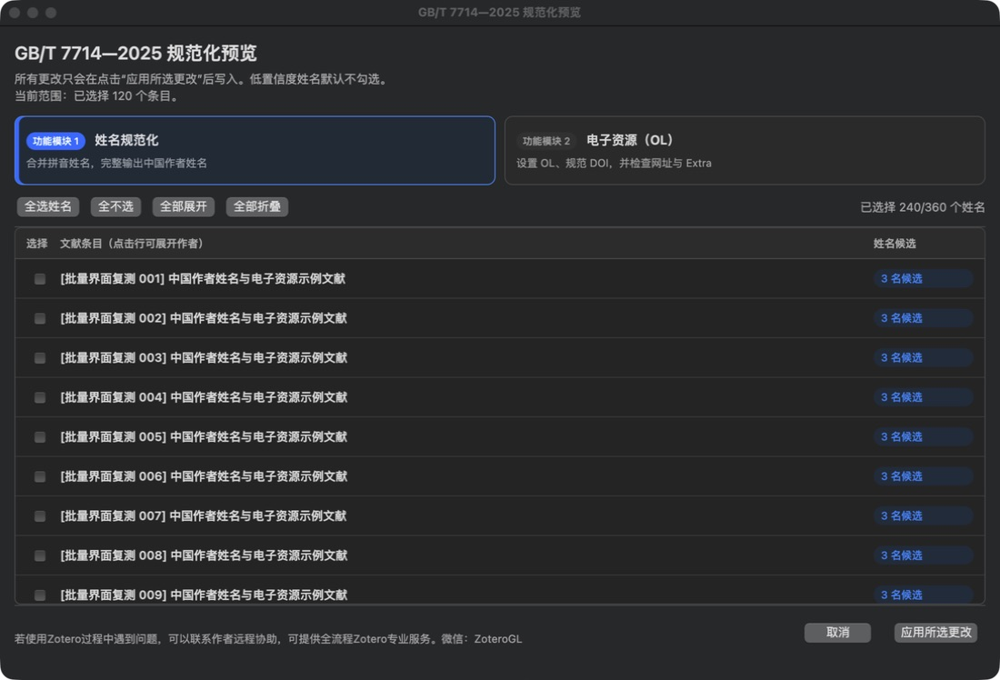
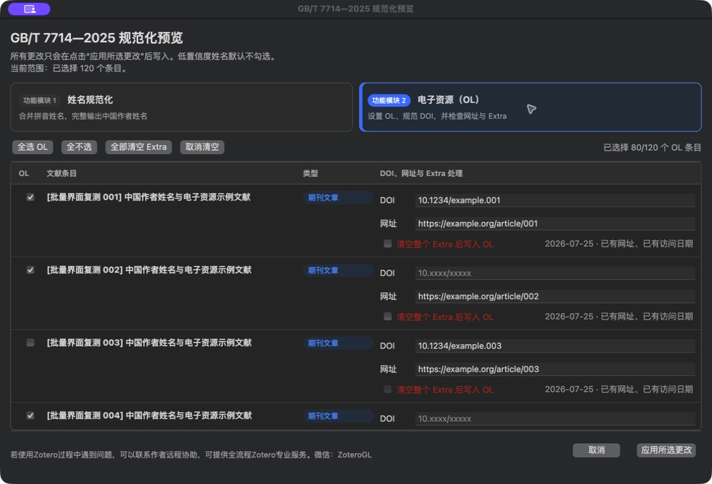

# GB/T 7714—2025 Helper for Zotero

[中文说明](README.md) · [Services](SERVICES.md) · [Privacy](PRIVACY.md)

A free and open-source Zotero 9 add-on for reviewing romanized Chinese names, marking online resources, and keeping persistent local undo history for GB/T 7714—2025 workflows.

If this add-on helps you, please consider starring the repository.

## Highlights

- Groups candidate creators by item and converts confirmed names to single-field forms such as `Wu Saixuan`.
- Writes an explicit `Medium: OL` marker while keeping volume, issue, and page metadata intact.
- Prefers DOI links and falls back to URL only when no DOI is available.
- Stores before/after snapshots locally and offers conflict-aware batch undo.
- Includes a Zotero/citeproc-js-specific bilingual numeric CSL style.

## Install

Download the XPI from GitHub Releases. In Zotero, open **Tools → Plugins**, click **Tools for all plugins**, choose **Install Plugin From File…**, and select the XPI.

## Batch preview

Name normalization and online-resource metadata are presented as two distinct modules. Creator candidates are grouped by item, online-resource fields use a table layout, and the list scrolls independently while the footer actions remain visible.

## Contact

若使用Zotero过程中遇到问题，可以联系作者远程协助，可提供全流程Zotero专业服务。

- Author: Zotero金牌讲师
- WeChat: `ZoteroGL`
- Email: `929459880@qq.com`

This is an independent project and is not affiliated with or endorsed by Zotero.

## License

Add-on code is licensed under [GNU AGPL v3](LICENSE). The companion CSL retains the license and source attribution declared in the style file.
